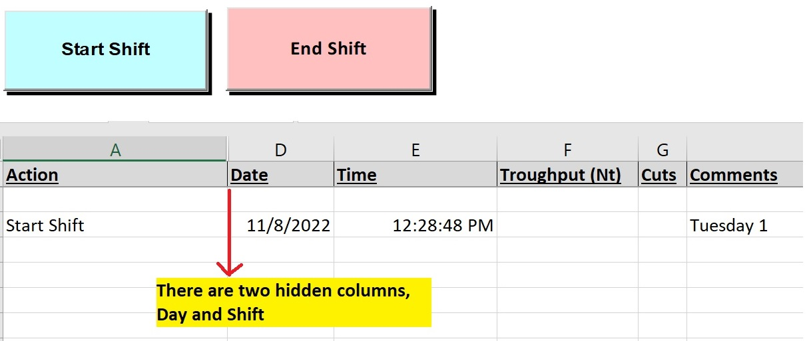
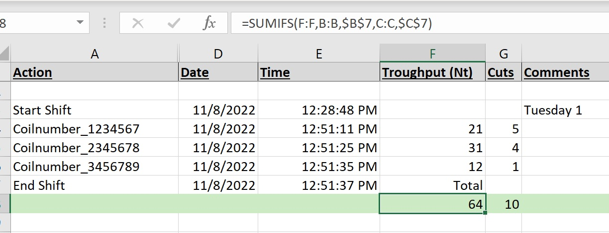

<div>
    <ul class="nav">
        <li class="nav"><a href="https://jrvasquez3.github.io/joservasquezperez/">Home</a></li>
        <li class="nav"><a href="https://jrvasquez3.github.io/joservasquezperez/about">About</a></li>
        <li class="nav"><a href="https://jrvasquez3.github.io/joservasquezperez/contact">Contact</a></li>
    </ul>
</div>

<link rel="stylesheet" href="styles.css">


# KPI 
### Author: Jose R Vasquez Perez

# Table of Contents
1. [Enable Developer Tools](#enable-developer-tools)
2. [START SHIFT](#start-shift)
3. [END SHIFT](#end-shift)
4. [Insert Data to Record Sheet](#insert-data-to-record-sheet)


I have made and created KPI for my past employer and thus, I want to share some of my knowledge to any reader curious about how to create KPIs using VBA. Below are some basic instructions I have created.

# Enable Developer Tools


First Step before developing anything with *Visual Basic for Applications* would be by enabling developer mode inside the application where you want to develop the dashboard (Microsoft Excel for our purposes).


# Start Shift
Add a *Command Button* into the sheet. Then, in VBA editor, if you want to allow the user to START SHIFT, do the following:

```vb
Private Sub Start_Shift_Click()
' Author: Jose R Vasquez Perez
' Set result = Sheets("Shift Record").Columns(1).Find("Start Shift")

' initializing variables 
Dim last As Integer
Dim result As Range
```

Afterwards, we would first like to ask the operator (or user) to enter the Shift number that they are working. Below is code I developed to do just that. Keep in mind that this is just one method to accomplish this and there are many other ways to do just this. The code below has the chance of "injection", however, for our purposes, this is okay.

```vb
' ask operator / user to enter shift number 
Range("X13").Value = InputBox("please insert your shift: 1 = first ; 2 = second ; 3 = third", "shift definition", "")

```

We will now add the current date to the shift record sheet. 

```vb

'finds last row on Shift record. Types current day of the week into column "comment", saves day into Panel Tab - JV
last = Sheets("Shift Record").Cells(Rows.Count, 1).End(xlUp).Row + 2
day_of_week = Weekday(Date)
If day_of_week = 1 Then
    Sheets("Shift Record").Cells(last, 8).Value = "Sunday " & Range("X13").Value
    Sheets("panel").Range("W14").Value = "Sunday"
ElseIf day_of_week = 2 Then
    Sheets("Shift Record").Cells(last, 8).Value = "Monday " & Range("X13").Value
    Sheets("panel").Range("W14").Value = "Monday"
ElseIf day_of_week = 3 Then
    Sheets("Shift Record").Cells(last, 8).Value = "Tuesday " & Range("X13").Value
    Sheets("panel").Range("W14").Value = "Tuesday"
ElseIf day_of_week = 4 Then
    Sheets("Shift Record").Cells(last, 8).Value = "Wednesday " & Range("X13").Value
    Sheets("panel").Range("W14").Value = "Wednesday"
ElseIf day_of_week = 5 Then
    Sheets("Shift Record").Cells(last, 8).Value = "Thursday " & Range("X13").Value
    Sheets("panel").Range("W14").Value = "Thursday"
ElseIf day_of_week = 6 Then
    Sheets("Shift Record").Cells(last, 8).Value = "Friday " & Range("X13").Value
    Sheets("panel").Range("W14").Value = "Friday"
ElseIf day_of_week = 7 Then
    Sheets("Shift Record").Cells(last, 8).Value = "Saturday " & Range("X13").Value
    Sheets("panel").Range("W14").Value = "Saturday"

End If


```

As you can tell, this code uses repeated "Elseif" statements. There are obviously better methods to implement this, however I decided to use only "ElseIf" statements for readability.

The reason as to why I decided to do this is because I trained an operator to be able to "read" VBA code in the event that when I am gone, he would be able to "read" the code and understand what is going on. I opted for better readability for non-technical individuals. 

Below, the code enters the information into the KPI records.

```vb
'types "start shift", today's date and time into last row - JV
last = Sheets("Shift Record").Cells(Rows.Count, 1).End(xlUp).Row + 2
Sheets("Shift Record").Cells(last, 1).Value = "Start Shift"
Sheets("Shift Record").Cells(last, 2).Value = Sheets("Panel").Range("X13")
Sheets("Shift Record").Cells(last, 3).Value = Sheets("Panel").Range("W14")
Sheets("Shift Record").Cells(last, 4).Value = Date
Sheets("Shift Record").Cells(last, 5).Value = Time

End Sub
```

Below is a screenshot of the resultant output on the record sheet




-----------------------

# End Shift

Add a *Command Button* into the sheet. Then, in VBA editor, if you want to allow the user to END SHIFT, do the following:


```vb
Private Sub End_Shift_Click()
' Author: jose R Vasquez P
' initialize variables
Dim last As Integer
Dim Name As String
Dim x As String
```
We want so that when an operator or user presses "End Shift", all the data found in between the beggining of the shift and the end of the shift is added into a cell ( in other words the total). 

Below, the code adds the standard information for entered data (current time, date, label stating end shift, etc.)

```vb
' Adds Total into last sheet, types End Shift and current time and date - JV

last = Sheets("Shift Record").Cells(Rows.Count, 1).End(xlUp).Row + 1
Sheets("Shift Record").Cells(last, 1).Value = "End Shift"
Sheets("Shift Record").Cells(last, 2).Value = Sheets("Panel").Range("X13")
Sheets("Shift Record").Cells(last, 3).Value = Sheets("Panel").Range("W14")
Sheets("Shift Record").Cells(last, 4).Value = Date
Sheets("Shift Record").Cells(last, 5).Value = Time
Sheets("Shift Record").Cells(last, 6).Value = "Total"
Sheets("Shift Record").Cells(last, 6).HorizontalAlignment = xlRight
Sheets("Shift Record").Cells(last, 11).Value = "Total"
```
Next, the code below gets the address for the cells found at the beggining of the shift, and the end of the shift, and creates a formula on the total cell. This means that if an operator were to later make a correction to the KPI, the "total" will also be updated. This is done by inserting an Excel formula using VBA.

The code is shown below:

```vb
Shift_num = Sheets("Shift Record").Cells(last, 2).Address
Shift_day = Sheets("Shift Record").Cells(last, 3).Address

last = Sheets("Shift Record").Cells(Rows.Count, 1).End(xlUp).Row + 1
Sheets("Shift Record").Cells(last, 6).Value = "=SUMIFS(F:F,B:B," & Shift_num & ",C:C," & Shift_day & ")"
Sheets("Shift Record").Cells(last, 7).Value = "=SUMIFS(G:G,B:B," & Shift_num & ",C:C," & Shift_day & ")"
Sheets("Shift Record").Cells(last, 11).Value = "=SUMIFS(K:K,B:B," & Shift_num & ",C:C," & Shift_day & ")"
Sheets("Shift Record").Rows(last).Interior.Color = RGB(204, 235, 197)

End Sub

```

Below is a screenshot of the resultant output on the record sheet when "End Shift" is pressed.




-------------------

# Insert Data to Record Sheet

Add a *Command Button* into the sheet. Then, in VBA editor, if you want to allow the user to Insert Data into the Record Sheet depending on some predetermined conditions (standardized event) do the following:

* below is an example of an event called 'Mechanical'. Users press this button when a mechanical problem occurs

```vb
' add a predetermined event that an operator / user experiences, that way
' when the said event occurs, they can just press the button
' and it will record it into the KPI

Sub mechanical()
Dim last As Integer

'adds "Mechanical" line to Shift record

last = Sheets("Shift Record").Cells(Rows.Count, 1).End(xlUp).Row + 1
Sheets("Shift Record").Cells(last, 1).Value = "Mechanical"
Sheets("Shift Record").Cells(last, 2).Value = Sheets("Panel").Range("X13")
Sheets("Shift Record").Cells(last, 3).Value = Sheets("Panel").Range("W14")
Sheets("Shift Record").Cells(last, 4).Value = Date
Sheets("Shift Record").Cells(last, 5).Value = Time

End Sub

```


If you are going this route, I recommend to add a "Back to Production" button. Basically, the main function of the button is to emphasize the fact that an event previously recorded into the Record Sheet has been resolved / is no longer causing down time etc. This is helpful to mantain records of approximately how long each event took away from production and other analysis. 


* Example: 

```vb
Sub BacktoP()
Dim last As Integer
'adds "back to production" line to Shift record

last = Sheets("Shift Record").Cells(Rows.Count, 1).End(xlUp).Row + 1
Sheets("Shift Record").Cells(last, 1).Value = "Back to Production"
Sheets("Shift Record").Cells(last, 2).Value = Sheets("Panel").Range("X13")
Sheets("Shift Record").Cells(last, 3).Value = Sheets("Panel").Range("W14")
Sheets("Shift Record").Cells(last, 4).Value = Date
Sheets("Shift Record").Cells(last, 5).Value = Time

End Sub
```


------------------


You can also add important key data for determining performance. This can be done by adding an option allowing users to manually input say Customer information or other important metrics that can only be physically measured into the KPI.


* Below is an image of a basic view of the input form


To add the data into the Record Sheet, simply do the following:


```vb

Sub Fill_Data()
Dim last As Integer
Dim i As Integer
'Author: Jose R Vasquez P


'Types Coil number, today's date and time into last row - JV
last = Sheets("Shift Record").Cells(Rows.Count, 1).End(xlUp).Row + 1
Sheets("Shift Record").Cells(last, 1).Value = "Coilnumber_" & Sheets("Panel").Batchnumber.Text
Sheets("Shift Record").Cells(last, 2).Value = Sheets("Panel").Range("X13")
Sheets("Shift Record").Cells(last, 3).Value = Sheets("Panel").Range("W14")
Sheets("Shift Record").Cells(last, 4).Value = Date
Sheets("Shift Record").Cells(last, 5).Value = Time
Sheets("Shift Record").Cells(last, 6).Value = Sheets("Panel").insertNt.Text
Sheets("Shift Record").Cells(last, 7).Value = Sheets("Panel").insertQty.Text
Sheets("Shift Record").Cells(last, 9).Value = Sheets("Panel").ComboBox1.Text

```


To add items to the ComboBox (for example, add different customer names), you can either hard code it or simply reference a cell range where the options for the combobox are given. I prefer the second option as this will allow regular employees to add customer names in the future without the need of someone having to code new options.


```vb
Private Sub ComboBox1_Change()

'Method to reference a range of cells for the combobox
ComboBox1.List = Sheets("Sheet1").Range("A1:A3").Value


'Method to "hard code" the options.
ComboBox1.List = Array("Option 1", "Option 2", "Option 3")

End Sub
```


